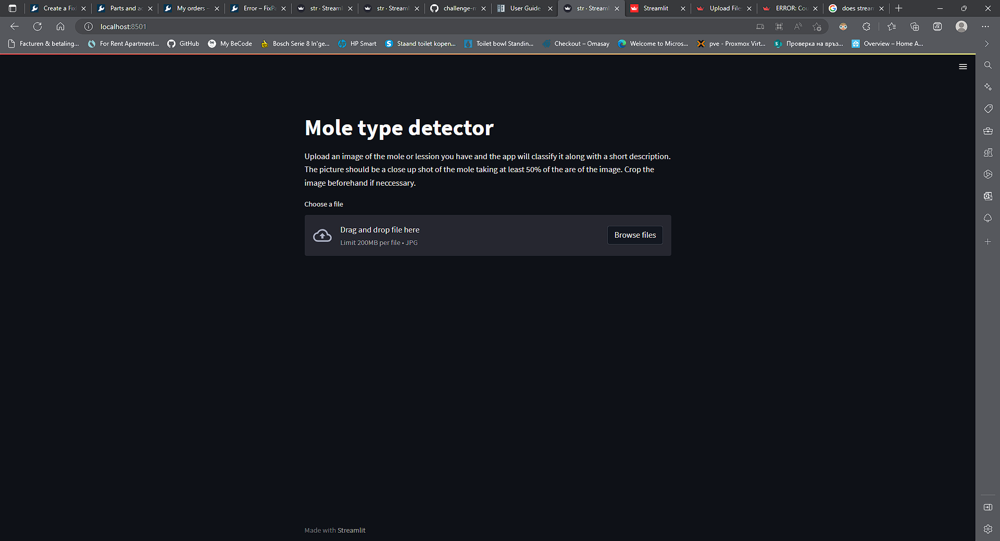
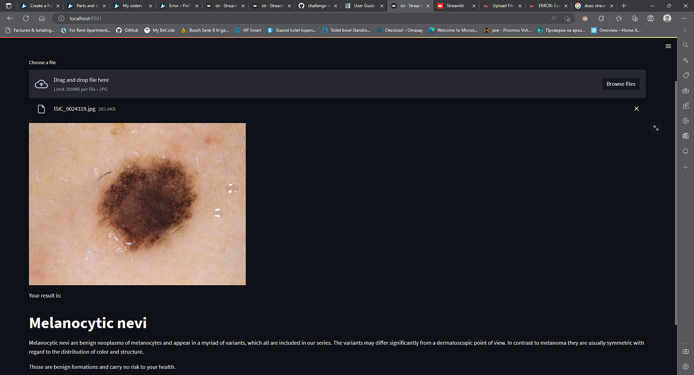

# Mole type detector

## Introduction

Skin lesions and moles sometimes are just cosmetic problems but they can also be a sign of serious problems and risks to overall health. Identifying them as benign or malignant is not a trivial task for the layman. The goal of this project is to train a model on many images of benign and malignant.

## Installation

You can find a requirements.txt file in the repo which contains the names of packages neccessary. You can use pip along with the aforementioned file to install the dependencies. 

IMPORTANT!! Github does not allow files larger than 100MB to be tracked. The trained model is just below 400MB. That's why i created a release with the model.h5 file. Be sure to download it and place it in the same directory where str.py is.

Then run this command to start a local running version of the app:

```
streamlit run str.py
```

A cloud running version deployment is in progress

## Usage

Go to the url of the app it should be localhost:8501 if running local or something like that, the url is displayed when you execute the command to run the app.



This is where you can upload the image. The results are displayed on the same screen.



## Further developments planned

This is just a proof of concept. The model itself needs a lot of improvement, the user interface also. 

Both or those are planned to be done in future. Check the repo regularly to keep track on those updates. I am working on them

## Contributor

Sedat Mehmed - Junior Machine leaning engineer

[Sedat Mehmed | LinkedIn](https://www.linkedin.com/in/sedat-mehmed-a58851199/)
